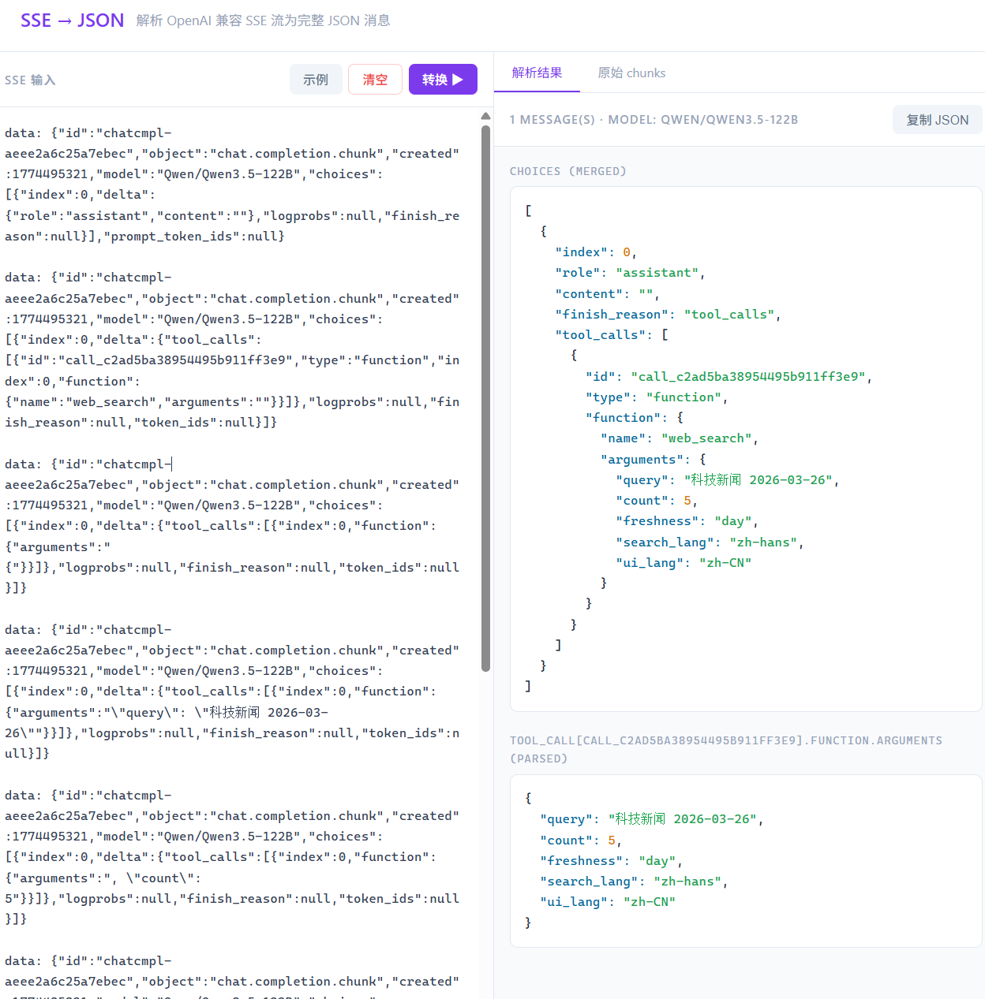

# SSE → JSON

将 OpenAI 兼容的 SSE stream 响应解析为完整 JSON 消息的网页工具。

## 功能

- 解析 `data: {...}` 格式的 SSE 流
- 合并所有 delta 片段，重建完整消息
- 自动拼接 `tool_calls[n].function.arguments` 碎片并解析为 JSON 对象
- 支持同时包含 `content` 文本流和 `tool_calls` 的响应
- 一键复制输出 JSON
- 查看原始 chunk 列表

## 使用

直接用浏览器打开 `index.html`，无需服务器或依赖。

粘贴 SSE 内容后自动触发解析，或点击"转换"按钮。

## 输入格式

```
data: {"id":"chatcmpl-xxx","choices":[{"index":0,"delta":{...}}],...}
data: {"id":"chatcmpl-xxx","choices":[{"index":0,"delta":{...}}],...}
data: [DONE]
```

## 输出

- **choices (merged)**：所有 delta 合并后的完整 choices 数组
- **tool_call arguments (parsed)**：工具调用参数的解析结果（如适用）
- **content (text)**：纯文本内容（如适用）

## 效果

